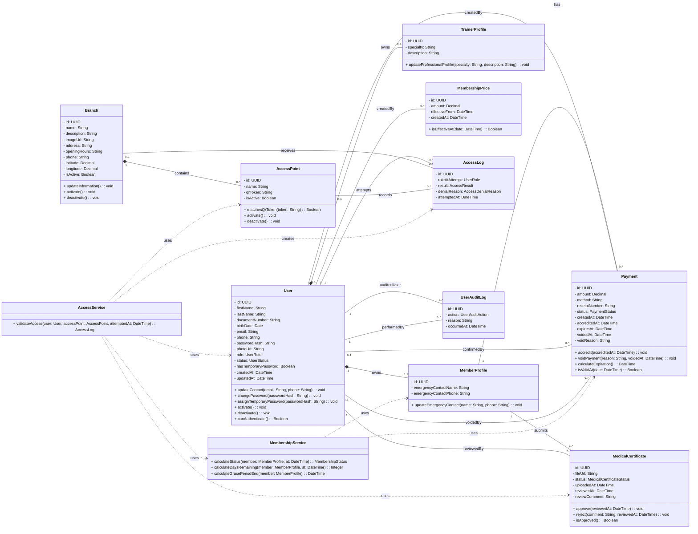
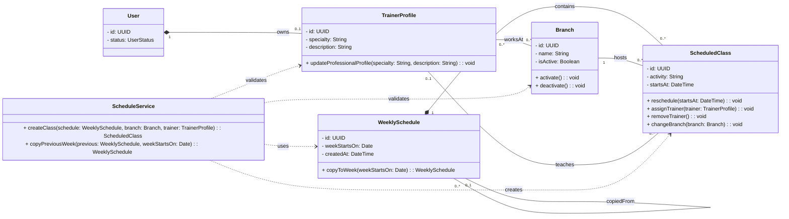
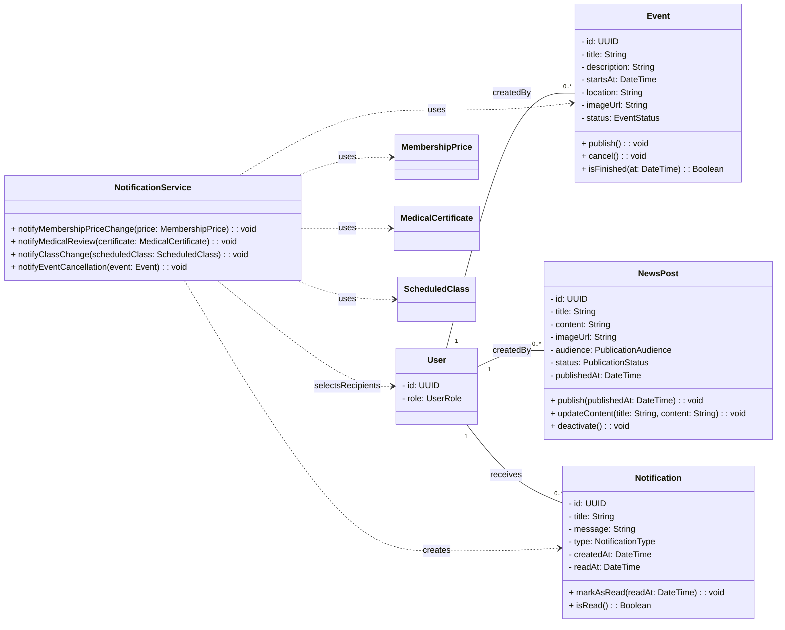

# Diagrama de clases de M-Team

Este documento representa las clases del dominio definidas por el alcance de M-Team. Utiliza UML con atributos privados, operaciones públicas relevantes, relaciones tipadas y multiplicidades en ambos extremos.

No incluye claves foráneas, tablas, controladores, DTO ni detalles de Prisma. Esos elementos pertenecen al modelo relacional y al diseño de capas. Los nombres del código se expresan en inglés, de acuerdo con las convenciones del proyecto.

## Usuarios, cuotas, aptos y accesos

## Sedes, cronogramas y entrenadores

## Eventos, novedades y notificaciones

## Enumeraciones del dominio

```mermaid
classDiagram
class UserRole {
  <<enumeration>>
  MEMBER
  TRAINER
  ADMIN
}
class UserStatus {
  <<enumeration>>
  ACTIVE
  INACTIVE
}
class MembershipStatus {
  <<enumeration>>
  CURRENT
  EXPIRING_SOON
  EXPIRED
}
class PaymentStatus {
  <<enumeration>>
  ACCREDITED
  VOIDED
}
class MedicalCertificateStatus {
  <<enumeration>>
  PENDING
  APPROVED
  REJECTED
}
class AccessResult {
  <<enumeration>>
  ALLOWED
  DENIED
}
class AccessDenialReason {
  <<enumeration>>
  INVALID_QR
  INACTIVE_USER
  INACTIVE_BRANCH
  INACTIVE_ACCESS_POINT
  EXPIRED_MEMBERSHIP
  MEDICAL_CERTIFICATE_REQUIRED
}
class UserAuditAction {
  <<enumeration>>
  CREATED
  UPDATED
  ACTIVATED
  DEACTIVATED
  PASSWORD_RESET
}
class EventStatus {
  <<enumeration>>
  DRAFT
  PUBLISHED
  CANCELLED
}
class PublicationAudience {
  <<enumeration>>
  ALL
  MEMBERS
  TRAINERS
}
class PublicationStatus {
  <<enumeration>>
  DRAFT
  PUBLISHED
  INACTIVE
}
class NotificationType {
  <<enumeration>>
  MEMBERSHIP_PRICE_CHANGED
  MEMBERSHIP_EXPIRING
  MEMBERSHIP_EXPIRED
  MEDICAL_CERTIFICATE_REVIEWED
  CLASS_CHANGED
  EVENT_CANCELLED
  GENERAL
}
```

## Decisiones de modelado

- Los atributos son privados y las modificaciones se realizan mediante operaciones públicas relevantes.
- Los identificadores de otras clases no se duplican como atributos: las asociaciones representan esas referencias.
- `MemberProfile`, `TrainerProfile`, `AccessPoint` y `ScheduledClass` se modelan mediante composición porque no tienen sentido de dominio sin su objeto contenedor.
- Pagos, aptos, registros, sedes, entrenadores y contenido mantienen identidad e historial propios; por eso utilizan asociaciones normales.
- `MembershipService`, `AccessService`, `ScheduleService` y `NotificationService` coordinan reglas que involucran varias entidades y no almacenan datos propios.
- `MembershipStatus` se calcula a partir de pagos acreditados; no se guarda como un atributo persistente.
- Un pago genera 30 días de vigencia sin acumular días anteriores. Al anularlo, se recalcula desde los pagos acreditados que continúen válidos.
- El período inicial de 20 días se calcula desde el primer pago acreditado que permanezca válido.
- Un apto aprobado no tiene vencimiento.
- El QR identifica un punto de acceso fijo; el usuario se identifica mediante su sesión.
- Cuando el QR no puede identificarse, el registro de acceso no se asocia con una sede ni con un punto de acceso.
- Las clases son informativas y no modelan reservas, cupos, listas de espera ni asistencia.
- Los eventos utilizan una ubicación libre y no se asocian obligatoriamente con una sede.

## Verificación de la consigna

| Criterio | Cumplimiento |
|---|---|
| Responsabilidad única por clase | Las entidades conservan su propio estado y los servicios coordinan reglas entre entidades. |
| Clases e interfaces en PascalCase | Todos los nombres de clases y enumeraciones usan PascalCase. |
| Métodos en camelCase y con verbo | Todas las operaciones comienzan con un verbo y expresan una acción concreta. |
| Atributos privados en camelCase | Todos los atributos usan `-` y camelCase. |
| Tipos de datos indicados | Cada atributo, parámetro y retorno declara su tipo. |
| Relaciones correctas | Se distinguen composición, asociación y dependencia. |
| Multiplicidades completas | Cada asociación indica multiplicidad en ambos extremos. |
| Entidades no duplicadas | Las clases repetidas entre bloques son referencias visuales al mismo concepto, no entidades diferentes. |

## Decisión pendiente

M-Team debe confirmar los medios de pago aceptados. Hasta entonces, `Payment.method` permanece como `String` y no se define una enumeración que agregue valores no aprobados por el alcance.
