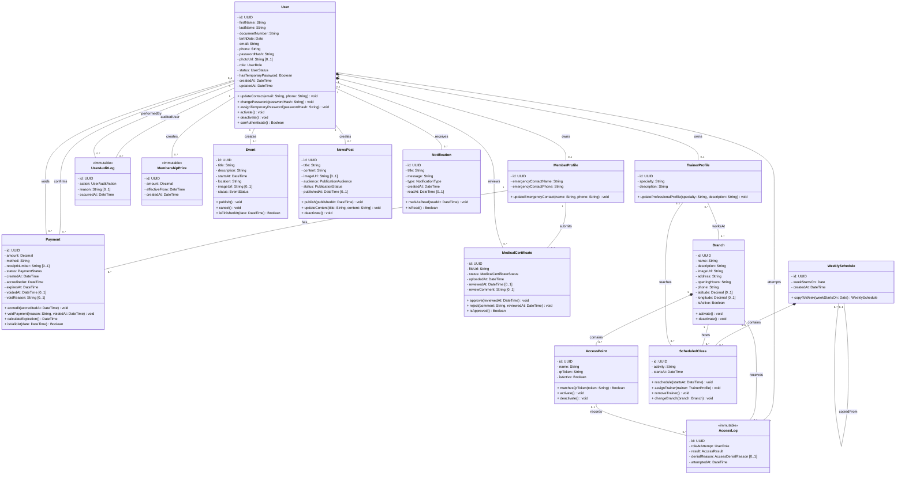

# Diagrama de clases de M-Team

Este diagrama representa en una única vista las entidades del dominio definidas en el alcance.

Los atributos son privados, los métodos públicos comienzan con un verbo y las asociaciones indican multiplicidad en ambos extremos. No se muestran claves foráneas porque pertenecen al modelo relacional.

## Enumeraciones

| Enum | Valores |
|---|---|
| `UserRole` | `MEMBER`, `TRAINER`, `ADMIN` |
| `UserStatus` | `ACTIVE`, `INACTIVE` |
| `MembershipStatus` | `CURRENT`, `EXPIRING_SOON`, `EXPIRED` |
| `PaymentStatus` | `ACCREDITED`, `VOIDED` |
| `MedicalCertificateStatus` | `PENDING`, `APPROVED`, `REJECTED` |
| `AccessResult` | `ALLOWED`, `DENIED` |
| `AccessDenialReason` | `INVALID_QR`, `INACTIVE_USER`, `INACTIVE_BRANCH`, `INACTIVE_ACCESS_POINT`, `EXPIRED_MEMBERSHIP`, `MEDICAL_CERTIFICATE_REQUIRED` |
| `UserAuditAction` | `CREATED`, `UPDATED`, `ACTIVATED`, `DEACTIVATED`, `PASSWORD_RESET` |
| `EventStatus` | `DRAFT`, `PUBLISHED`, `CANCELLED` |
| `PublicationAudience` | `ALL`, `MEMBERS`, `TRAINERS` |
| `PublicationStatus` | `DRAFT`, `PUBLISHED`, `INACTIVE` |
| `NotificationType` | `MEMBERSHIP_PRICE_CHANGED`, `MEMBERSHIP_EXPIRING`, `MEMBERSHIP_EXPIRED`, `MEDICAL_CERTIFICATE_REVIEWED`, `CLASS_CHANGED`, `EVENT_CANCELLED`, `GENERAL` |

## Restricciones y decisiones

- `MemberProfile` y `TrainerProfile` son mutuamente excluyentes. `MEMBER` requiere `MemberProfile`, `TRAINER` requiere `TrainerProfile` y `ADMIN` no requiere ninguno.
- `MembershipStatus` se calcula desde los pagos acreditados y no se almacena como atributo.
- `UserAuditLog` y `AccessLog` son registros históricos inmutables; por eso no exponen métodos modificadores.
- `Branch` y `AccessPoint` son opcionales en `AccessLog` solamente cuando el QR es inexistente o fue alterado.
- Cada pago acreditado genera 30 días de vigencia sin acumular días anteriores.
- Al anular un pago se recalculan la vigencia y el período inicial desde los pagos que permanezcan válidos.
- El período inicial para ingresar sin apto aprobado dura 20 días desde el primer pago acreditado válido.
- Un apto aprobado permanece válido sin fecha de vencimiento.
- El QR identifica un punto de acceso fijo; el usuario se identifica mediante su sesión.
- Las clases son informativas y no incluyen reservas, cupos, listas de espera ni asistencia.
- Los servicios, controladores, repositorios y DTO se documentan en el diseño de capas y no se modelan como entidades.

## Decisión pendiente

M-Team debe confirmar los medios de pago aceptados. Hasta entonces, `Payment.method` permanece como `String`.
