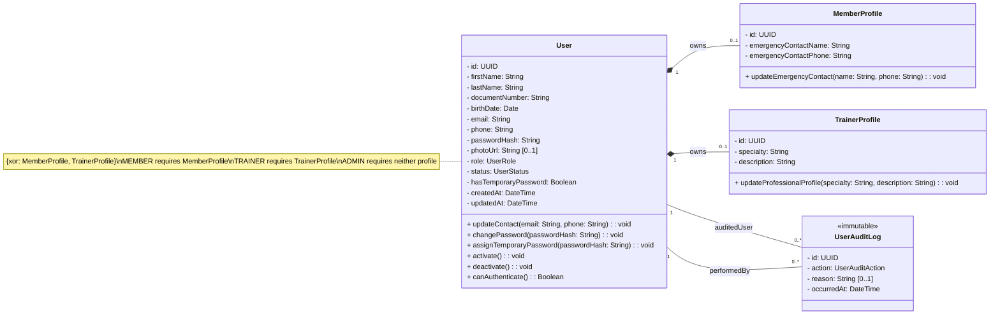
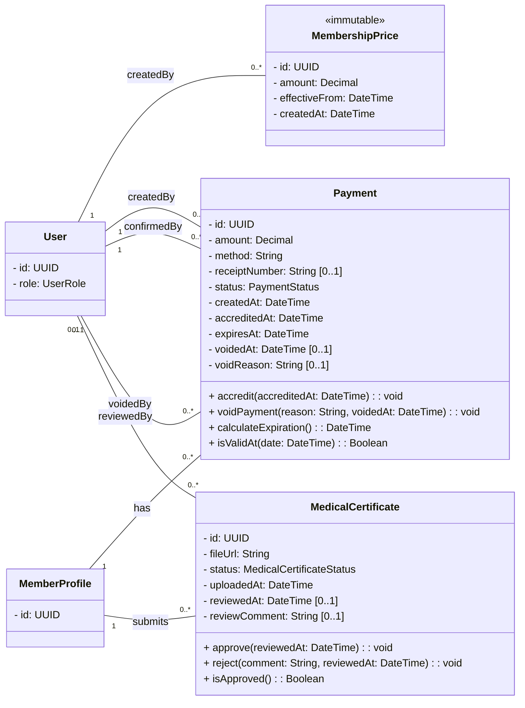
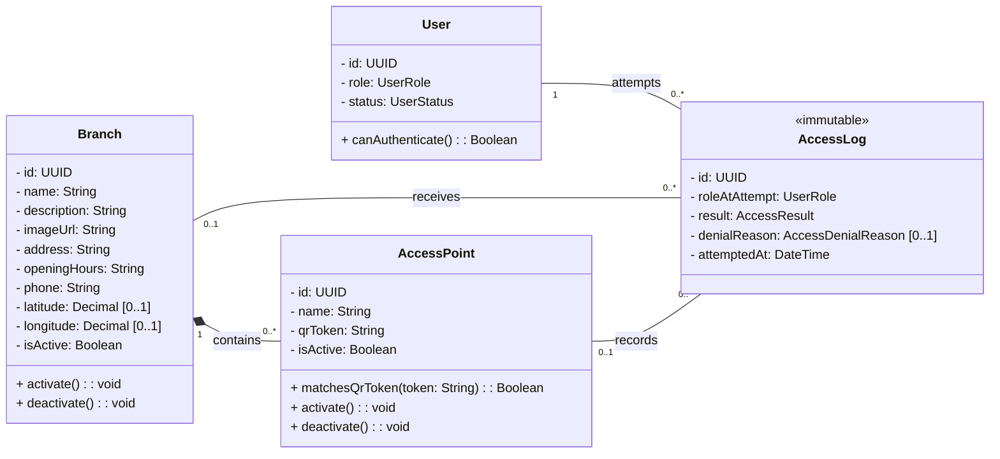
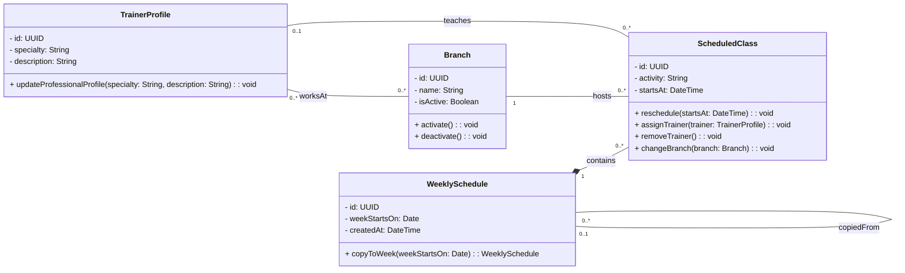
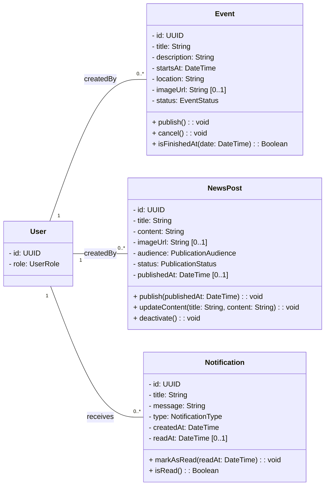

# Diagrama de clases de M-Team

El modelo se presenta mediante vistas temáticas para mantenerlo legible. Todas las vistas representan el mismo dominio y las clases repetidas son el mismo concepto, mostrado solamente con los miembros relevantes para cada módulo.

Los atributos son privados, las operaciones públicas relevantes comienzan con un verbo y todas las asociaciones indican multiplicidad en ambos extremos. No se muestran claves foráneas porque pertenecen al modelo relacional.

## 1. Usuarios y perfiles

## 2. Cuota, pagos y aptos médicos

El estado de cuota `CURRENT`, `EXPIRING_SOON` o `EXPIRED` se calcula desde los pagos acreditados y no se almacena como atributo.

## 3. Control de acceso

`Branch` y `AccessPoint` son opcionales en un registro cuando el QR es inexistente o fue alterado. La validación completa del ingreso coordina usuario, cuota, apto, sede y punto de acceso; se implementará en la capa de servicios y no como una entidad adicional.

## 4. Sedes, cronogramas y entrenadores

Las clases son informativas: no incluyen reservas, cupos, listas de espera ni control de asistencia.

## 5. Eventos, novedades y notificaciones

Los eventos utilizan una ubicación libre. Las notificaciones se generan desde servicios de aplicación ante aumentos de cuota, vencimientos, revisiones de aptos, cambios de clases y cancelaciones de eventos.

## Enumeraciones

| Enum | Valores |
|---|---|
| `UserRole` | `MEMBER`, `TRAINER`, `ADMIN` |
| `UserStatus` | `ACTIVE`, `INACTIVE` |
| `MembershipStatus` | `CURRENT`, `EXPIRING_SOON`, `EXPIRED` |
| `PaymentStatus` | `ACCREDITED`, `VOIDED` |
| `MedicalCertificateStatus` | `PENDING`, `APPROVED`, `REJECTED` |
| `AccessResult` | `ALLOWED`, `DENIED` |
| `AccessDenialReason` | `INVALID_QR`, `INACTIVE_USER`, `INACTIVE_BRANCH`, `INACTIVE_ACCESS_POINT`, `EXPIRED_MEMBERSHIP`, `MEDICAL_CERTIFICATE_REQUIRED` |
| `UserAuditAction` | `CREATED`, `UPDATED`, `ACTIVATED`, `DEACTIVATED`, `PASSWORD_RESET` |
| `EventStatus` | `DRAFT`, `PUBLISHED`, `CANCELLED` |
| `PublicationAudience` | `ALL`, `MEMBERS`, `TRAINERS` |
| `PublicationStatus` | `DRAFT`, `PUBLISHED`, `INACTIVE` |
| `NotificationType` | `MEMBERSHIP_PRICE_CHANGED`, `MEMBERSHIP_EXPIRING`, `MEMBERSHIP_EXPIRED`, `MEDICAL_CERTIFICATE_REVIEWED`, `CLASS_CHANGED`, `EVENT_CANCELLED`, `GENERAL` |

## Reglas de modelado

- Los atributos son privados y solo se muestran operaciones públicas relevantes; no se incluyen getters ni setters triviales.
- `UserAuditLog` y `AccessLog` no tienen métodos porque son registros históricos inmutables, creados por los servicios y utilizados para consulta.
- Los servicios, controladores, repositorios y DTO se documentarán en el diseño de capas; no son entidades del dominio.
- `MemberProfile`, `TrainerProfile`, `AccessPoint` y `ScheduledClass` utilizan composición porque dependen conceptualmente de su contenedor.
- Pagos, aptos, registros, sedes, entrenadores y publicaciones conservan identidad e historial propios y utilizan asociaciones normales.
- El precio de la cuota es único para todos los socios y conserva su historial.
- Cada pago acreditado genera 30 días de vigencia sin acumular días anteriores.
- Al anular un pago, la vigencia y el período inicial se recalculan utilizando los pagos acreditados que permanezcan válidos.
- El período inicial para ingresar sin apto aprobado dura 20 días desde el primer pago acreditado válido.
- Un apto aprobado permanece válido sin fecha de vencimiento.
- El QR identifica un punto de acceso fijo y el usuario se identifica mediante su sesión.
- Desactivar una entidad no elimina sus relaciones ni registros históricos.

## Decisión pendiente

M-Team debe confirmar los medios de pago aceptados. Hasta entonces, `Payment.method` permanece como `String` y no se agrega una enumeración con valores no aprobados.
